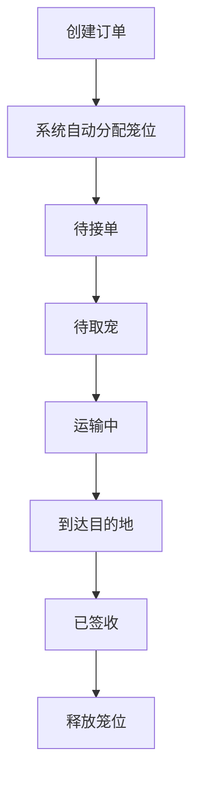

## 1. 产品概述

本系统是一个面向小型宠物托运公司的订单追踪与笼位管理工具，旨在帮助公司高效管理宠物托运订单，实时追踪运输状态，合理分配笼位资源，并保障宠物运输过程中的健康与安全。

- 目标用户：宠物托运公司运营人员、客服人员
- 核心价值：简化订单流程、可视化笼位管理、实时状态追踪、规范化运输记录

## 2. 核心功能

### 2.1 用户角色
| 角色 | 注册方式 | 核心权限 |
|------|----------|----------|
| 运营人员 | 无需注册（单用户系统） | 创建订单、更新状态、管理笼位、查看报表、导出PDF |

### 2.2 功能模块
1. **订单管理模块**：创建订单、订单列表、状态更新、日期筛选
2. **笼位管理模块**：20个笼位可视化、温湿度监控、消毒记录
3. **宠物健康记录模块**：饮食状态、精神状态记录
4. **地图预览模块**：Leaflet地图展示起运地到目的地运输路线
5. **PDF导出模块**：生成包含完整信息的托运单

### 2.3 页面详情
| 页面名称 | 模块名称 | 功能描述 |
|----------|----------|----------|
| 主仪表盘 | 顶部导航 | Logo、系统名称、日期筛选控件 |
| 主仪表盘 | 统计卡片 | 今日待接单、运输中、笼位使用率 |
| 主仪表盘 | 新建订单表单 | 宠物信息、起运地、目的地、托运日期录入 |
| 主仪表盘 | 订单列表 | 按状态/日期筛选，显示订单卡片，支持状态流转 |
| 主仪表盘 | 笼位管理区 | 20个笼位网格，显示占用状态、温湿度、消毒状态 |
| 订单详情弹窗 | 宠物信息区 | 品种、体重、疫苗状态展示 |
| 订单详情弹窗 | 状态时间线 | 各状态变更时间与操作人记录 |
| 订单详情弹窗 | 健康记录 | 饮食、精神状态历史记录 |
| 订单详情弹窗 | 地图预览 | Leaflet地图展示运输路线 |
| 订单详情弹窗 | PDF导出 | 生成托运单PDF并下载 |

## 3. 核心流程

用户创建订单 → 系统自动分配空闲笼位 → 运营人员点击"接单" → 点击"待取宠" → 点击"运输中" → 点击"到达目的地" → 点击"已签收" → 笼位释放

## 4. 用户界面设计

### 4.1 设计风格
- **主色调**：温暖的森林绿 (#2D6A4F)，代表自然与安心
- **辅助色**：暖橙色 (#E76F51)，用于警示和强调状态
- **中性色**：米白背景 (#FAF9F6)，深灰文字 (#1B1B1B)
- **按钮风格**：圆角矩形，柔和阴影，悬停微放大效果
- **字体**：标题使用"Noto Serif SC"衬线体，正文使用"Noto Sans SC"无衬线体
- **布局风格**：卡片式布局，信息分区清晰，大量留白
- **图标风格**：Lucide图标库，简约线性风格

### 4.2 页面设计概览
| 页面名称 | 模块名称 | UI元素 |
|----------|----------|--------|
| 主仪表盘 | 顶部导航 | 渐变背景、Logo、系统标题、筛选控件 |
| 主仪表盘 | 统计卡片 | 彩色渐变背景、数字动画、图标装饰 |
| 主仪表盘 | 新建订单 | 表单卡片、标签动画、下拉选择、日期选择器 |
| 主仪表盘 | 订单列表 | 标签页切换、订单卡片、状态徽章、操作按钮 |
| 主仪表盘 | 笼位管理 | 网格布局、状态颜色编码、悬浮提示 |
| 详情弹窗 | 时间线 | 垂直时间线、状态节点、时间戳 |
| 详情弹窗 | 地图 | 全屏地图容器、路线标记、缩放控件 |

### 4.3 响应式
- 桌面端优先设计（1280px+）
- 平板端（768px-1279px）：网格自适应，笼位改为4列
- 移动端（<768px）：单列布局，表单简化，重要信息优先展示
