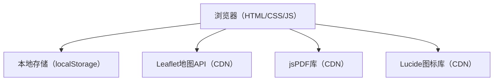
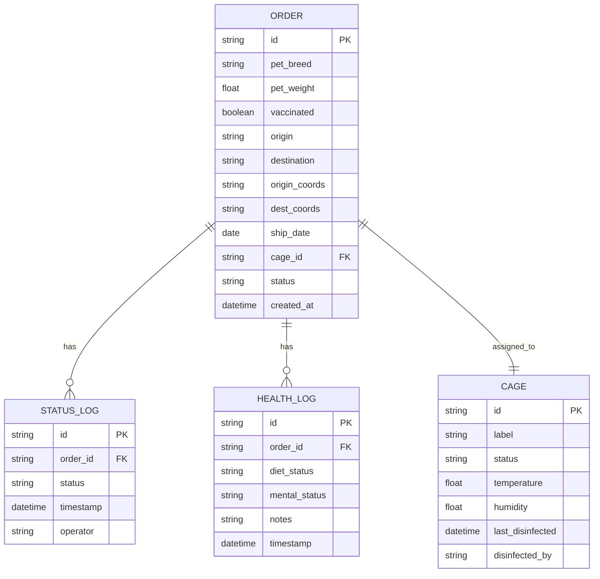

## 1. 架构设计



## 2. 技术描述

- **前端技术栈**：原生HTML5 + CSS3 + Vanilla JavaScript（ES6+）
- **构建工具**：无需构建工具，纯静态文件
- **外部库（CDN引入）**：
  - Leaflet 1.9.x - 地图渲染
  - jsPDF 2.5.x - PDF生成
  - Lucide - 图标库
- **数据存储**：浏览器 localStorage（模拟持久化存储）
- **部署方式**：静态文件部署，任何Web服务器均可运行

## 3. 页面结构（单页应用）

| 区域 | 说明 |
|------|------|
| #app | 应用根容器 |
| header | 顶部导航栏（含日期筛选） |
| .stats-bar | 统计数据卡片区域 |
| .main-content | 双栏主内容区 |
| .left-panel | 左侧：新建订单表单 + 订单列表 |
| .right-panel | 右侧：笼位管理网格 |
| #modal-root | 订单详情弹窗容器 |

## 4. 数据模型

### 4.1 数据模型定义



### 4.2 状态枚举

```
订单状态: pending → waiting_pickup → in_transit → arrived → delivered
笼位状态: available → occupied → cleaning
```

## 5. 文件结构

```
/
├── index.html              # 主HTML文件
├── css/
│   └── style.css          # 全部样式
├── js/
│   ├── app.js             # 主入口，初始化
│   ├── store.js           # 数据管理（localStorage封装）
│   ├── orderManager.js    # 订单业务逻辑
│   ├── cageManager.js     # 笼位管理逻辑
│   ├── mapView.js         # Leaflet地图封装
│   ├── pdfGenerator.js    # jsPDF PDF生成
│   └── ui.js              # UI渲染与交互
└── data/
    └── seed.js            # 初始模拟数据（可选）
```
